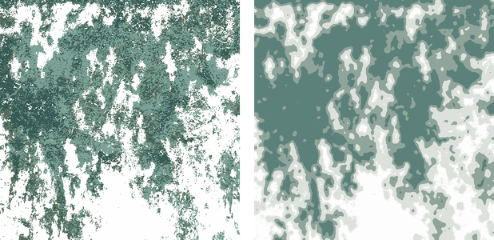

# HydroCalc - 优先流指标评估系统 | Preferential Flow Index Evaluation System

[English](#english) | [中文](#chinese)

<a id="chinese"></a>
# 基于智能算法的优先流指标评估系统

## 目录
- [项目描述](#项目描述)
- [功能特点](#功能特点)
- [安装与使用](#安装与使用)
  - [环境要求](#1-环境要求)
  - [部署步骤](#2-部署步骤)
  - [使用说明](#3-使用说明)
  - [示例图像](#4-示例图像)
- [贡献](#贡献)
- [开源许可证](#开源许可证)

## 项目描述

"[HydroCalc](https://github.com/lnk137/HydroCalc)"是一套专为生态修复、水土保持、水文地质、土壤科学、环境科学等领域设计的优先流指标计算与分析软件系统。本项目集成了先进的数据处理算法、智能分析和人工智能训练模型，以及三维可视化技术，旨在提供高效、准确的优先流指标计算方法。

该系统通过 Python 编程语言进行图像处理，前端基于 Vue 框架展示优先流指标

## 功能特点

- **智能计算优先流指标**：计算染色面积比、优先流百分比、优先染色面积比、染色面积、基质流深度、最大染色深度、长度指数等七个指标。
- **图像处理与分析**：使用 HSV 阈值对图像进行掩码处理，采用 K-means 聚类算法进行图像颜色分类，并支持高斯模糊处理。
- **三维建模**：通过纵切片图片进行三维聚类建模，创新性地摆脱了传统雷达探测的限制。
- **人工智能集成**：导入U-net自动预测并生成分类结果。
- **图像导出与数据分析**：支持导出处理后的图像及像素矩阵表，生成土壤剖面染色面积比随深度变化的图表，并通过线性回归分析优先流指标。

## 安装与使用

### 1. 环境要求

- Python 3.x
- Vue.js

### 2. 部署步骤

1. 克隆项目：
   ```bash
   git clone git@github.com:lnk137/HydroCalc.git
   ```

2. 安装 Python 依赖：
   ```bash
   pip install -r requirements.txt
   ```

3. 启动前端：
   ```bash
   cd frontend
   npm install
   npm run serve
   ```

4. 启动后端：
   ```bash
   cd backend
   python app.py
   ```

### 3. 使用说明

1. **启动软件系统**：启动后端程序，进入前端界面等待加载。
2. **导入图片文件夹路径**：从脚本中导入存放图片的文件夹路径以进行三维建模。
4. **调整 HSV 阈值**：根据需求调整 HSV 阈值来优化图像处理效果。
5. **上传图像**：通过拖拽或选择路径上传土壤剖面图。
6. **查看与导出结果**：查看优先流指标计算结果并导出相关数据表。

### 4. 示例图像

- **原图与处理图像**：提供分辨率调整后的原图、黑白二值图、高斯模糊后的聚类图等。

  

- **K-means 聚类图**：通过 K-means 聚类算法分析颜色分类，展示优先流与基质流的分布。

  

## 贡献

欢迎开发者和研究人员贡献代码与意见，帮助改进此系统。如果您有兴趣，您可以通过提交 Pull Request 或提出 Issues 来参与。

## 开源许可证

本项目采用 MIT 许可证，详细内容请见 [LICENSE](LICENSE) 文件。

<a id="english"></a>
# Preferential Flow Index Evaluation System Based on Intelligent Algorithms

## Table of Contents
- [HydroCalc - 优先流指标评估系统 | Preferential Flow Index Evaluation System](#hydrocalc---优先流指标评估系统--preferential-flow-index-evaluation-system)
- [基于智能算法的优先流指标评估系统](#基于智能算法的优先流指标评估系统)
  - [目录](#目录)
  - [项目描述](#项目描述)
  - [功能特点](#功能特点)
  - [安装与使用](#安装与使用)
    - [1. 环境要求](#1-环境要求)
    - [2. 部署步骤](#2-部署步骤)
    - [3. 使用说明](#3-使用说明)
    - [4. 示例图像](#4-示例图像)
  - [贡献](#贡献)
  - [开源许可证](#开源许可证)
- [Preferential Flow Index Evaluation System Based on Intelligent Algorithms](#preferential-flow-index-evaluation-system-based-on-intelligent-algorithms)
  - [Table of Contents](#table-of-contents)
  - [Project Description](#project-description)
  - [Features](#features)
  - [Installation and Usage](#installation-and-usage)
    - [1. Requirements](#1-requirements)
    - [2. Deployment Steps](#2-deployment-steps)
    - [3. Usage Guide](#3-usage-guide)
    - [4. Example Images](#4-example-images)
  - [Contributing](#contributing)
  - [License](#license)

## Project Description

"[HydroCalc](https://github.com/lnk137/HydroCalc)" is a comprehensive software system designed for calculating and analyzing preferential flow indices in ecological restoration, soil and water conservation, hydrogeology, soil science, and environmental science. This project integrates advanced data processing algorithms, intelligent analysis, AI training models, and 3D visualization technology to provide efficient and accurate preferential flow index calculations.

The system processes images using Python programming language and displays preferential flow indicators through a Vue-based frontend interface.

## Features

- **Intelligent Preferential Flow Index Calculation**: Calculates seven indicators including stained area ratio, preferential flow percentage, preferential stained area ratio, stained area, matrix flow depth, maximum staining depth, and length index.
- **Image Processing and Analysis**: Uses HSV thresholding for image masking, K-means clustering for color classification, and supports Gaussian blur processing.
- **3D Modeling**: Performs 3D clustering modeling through vertical slice images, innovatively breaking free from traditional radar detection limitations.
- **AI Integration**: Imports U-net for automatic prediction and classification result generation.
- **Image Export and Data Analysis**: Supports exporting processed images and pixel matrix tables, generates soil profile stained area ratio charts varying with depth, and analyzes preferential flow indicators through linear regression.

## Installation and Usage

### 1. Requirements

- Python 3.x
- Vue.js

### 2. Deployment Steps

1. Clone the project:
   ```bash
   git clone git@github.com:lnk137/HydroCalc.git
   ```

2. Install Python dependencies:
   ```bash
   pip install -r requirements.txt
   ```

3. Start the frontend:
   ```bash
   cd frontend
   npm install
   npm run serve
   ```

4. Start the backend:
   ```bash
   cd backend
   python app.py
   ```

### 3. Usage Guide

1. **Launch the System**: Start the backend program and wait for the frontend interface to load.
2. **Import Image Folder Path**: Import the folder path containing images from the script for 3D modeling.
3. **Adjust HSV Threshold**: Optimize image processing effects by adjusting HSV thresholds as needed.
4. **Upload Image**: Upload soil profile images by dragging and dropping or selecting the path.
5. **View and Export Results**: View preferential flow index calculation results and export relevant data tables.

### 4. Example Images

- **Original and Processed Images**: Provides resolution-adjusted original images, black and white binary images, Gaussian blurred clustered images, etc.

  

- **K-means Clustered Image**: Analyzes color classification using the K-means clustering algorithm, showing the distribution of preferential flow and matrix flow.

  

## Contributing

Developers and researchers are welcome to contribute code and suggestions to help improve this system. If you are interested, you can participate by submitting Pull Requests or raising Issues.

## License

This project is licensed under the MIT License. See the [LICENSE](LICENSE) file for details.
